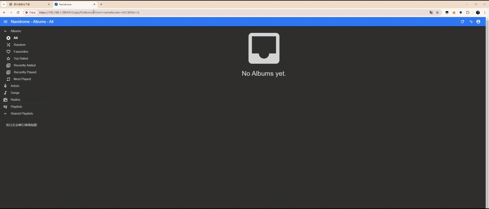

# Music Downloader

一个基于 Django 的音乐搜索与下载服务，可部署到NAS上搜素下载音乐到本地供Navidrome播放。

音乐API使用 [GD Studio](https://music-api.gdstudio.xyz/) 提供的接口。在此感谢 GD Studio 提供的 API 支持。

## 功能特性

- 支持多平台音乐搜索。
- 支持一键下载音乐到Navidrome媒体目录。
- 自动写入音乐文件的元数据（如标题、艺术家、专辑等）。
- 自动写入歌词到媒体文件，便于Navidrome读取。

## 项目结构

```
music_downloader/
├── music_service/
│   ├── music_downloader/
│   │   ├── migrations/
│   │   ├── templates/
│   │   │   └── index.html
│   │   ├── admin.py
│   │   ├── api_url.py
│   │   ├── apps.py
│   │   ├── models.py
│   │   ├── tests.py
│   │   ├── urls.py
│   │   └── views.py
│   ├── music_service/
│   │   ├── asgi.py
│   │   ├── settings.py
│   │   ├── urls.py
│   │   ├── wsgi.py
│   ├── db.sqlite3
│   ├── manage.py
├── Dockerfile
├── requirements.txt
└── .gitignore
```

## 快速开始

### 环境要求

- Python 3.10+
- Django 4.2+
- Docker（可选）

### 本地运行

1. 克隆项目代码：

   ```bash
   git clone https://github.com/BoundlessLearning/music_downloader.git
   cd music_downloader/music_service
   ```

2. 安装依赖：

   ```bash
   pip install -r requirements.txt
   ```

3. 启动开发服务器：

   ```bash
   python manage.py runserver 0.0.0.0:16333
   ```

4. 打开浏览器访问 [http://127.0.0.1:16333](http://127.0.0.1:16333)。

### 使用 Docker 部署

#### 获取镜像
1. 拉取阿里云仓库的 Docker 镜像：

    ```bash
    docker pull crpi-bob2om6u5fo80kfm.cn-hangzhou.personal.cr.aliyuncs.com/boundlesslearning/music_downloader:1.0.0 

    docker tag crpi-bob2om6u5fo80kfm.cn-hangzhou.personal.cr.aliyuncs.com/boundlesslearning/music_downloader:1.0.0 music_downloader:1.0.0
    ```
    
    或者本地构建:

    ```bash
    docker build -t music_downloader .
    ```

#### 运行容器

1. docker run运行容器：

   ```bash
   docker run -d \
    -e DJANGO_PORT=16333 \
    -e CSRF_TRUSTED_ORIGINS=https://your-domain.com \
    -v /home/user/music:/media \
    -p 16333:16333 music_downloader:1.0.0
   ```

   或者使用 docker-compose：

    ```yaml
    version: '2'
    services:
        django:
            image: music_downloader:1.0.0
            container_name: music_downloader
            ports:
                - "16333:16333"
            environment:
                - DJANGO_PORT=16333
                - CSRF_TRUSTED_ORIGINS=https://your-domain.com
            volumes:
                - /home/user/music:/media
    ```

    其中：
    - `/home/user/music` 是本地存储音乐文件的绝对路径。该路径会被挂载到容器内的 `/media` 目录，用于存储和访问上传或下载的音乐文件，如果使用Navidrome播放音乐，请确保该路径与Navidrome的媒体目录一致。
    - `https://your-domain.com` 是允许的 CSRF 来源地址。例如`http://127.0.0.1:16333`，如果使用了 Nginx 反向代理并启用了 HTTPS，请填写 HTTPS 的地址，例如 `https://your-domain.com`。

2. 打开浏览器访问 [http://127.0.0.1:16333](http://127.0.0.1:16333)。

    

## 配置

### 环境变量

- `DJANGO_PORT`: 指定运行端口，默认 `16333`。
- `CSRF_TRUSTED_ORIGINS`: 配置允许的 CSRF 来源。

### 静态文件与媒体文件

- 媒体文件路径：`/media/`

## 贡献

欢迎提交 Issue 和 Pull Request 来改进本项目。

## 许可证

本项目基于 [MIT License](LICENSE) 开源。

## 鸣谢

- [GD Studio](https://music-api.gdstudio.xyz/) - 提供音乐搜索和下载接口。
